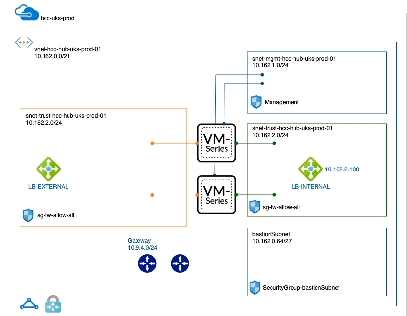

# arm

<a href='https://portal.azure.com/#create/Microsoft.Template/uri/https%3A%2F%2Fraw.githubusercontent.com%2Fphiltaylor%2Fhullcc-arm%2Fmaster%2Fuks-deploy2.json'>deploy to Azure UKS</a>

Ingress LB, 2 NGFW, untrust, trust, mgmt, egress LB - VNET resides in different RG to NGFW

<a href='https://portal.azure.com/#create/Microsoft.Template/uri/https%3A%2F%2Fraw.githubusercontent.com%2Fphiltaylor%2Fhullcc-arm%2Fmaster%2Fgateshead-uks.json'>deploy Gateshead to Azure UKS</a>

Ingress LB, 2 NGFW, untrust, trust, mgmt, egress LB - VNET resides in different RG to NGFW

