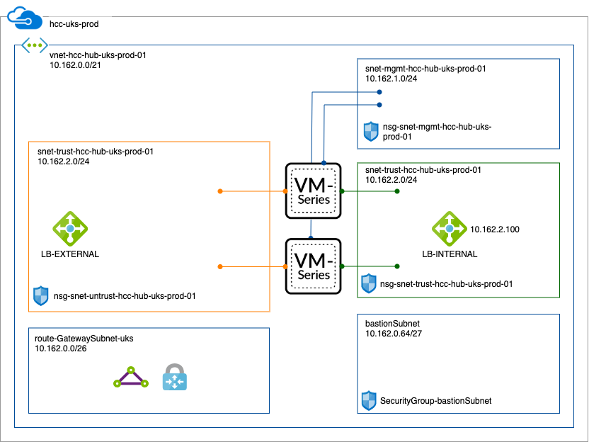

# arm

<a href='https://portal.azure.com/#create/Microsoft.Template/uri/https://raw.githubusercontent.com/philtaylor/hullcc-arm/master/uks-deploy.json'>Deploy uks Template</a>

Ingress LB, 2 NGFW, untrust, trust, mgmt, egress LB - VNET resides in different RG to NGFW

